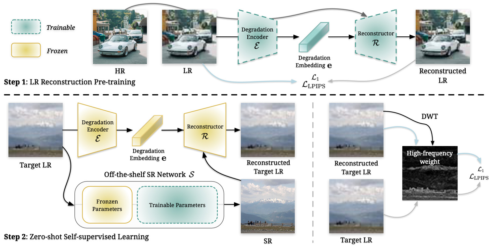

# Low-Res Leads the Way: Improving Generalization for Super-Resolution by Self-Supervised Learning

[[arXiv]](https://arxiv.org/abs/2403.02601)    [[homepage]](https://haoyuchen.com/LWay)





> Due to company policy constraints, we are unable to release our complete codebase and models. However, the good news is that this work is highly reproducible. In this repository, I will provide some of the key elements and tips to help facilitate the replication of our results.

## Step 1: LR Reconstruction Branch

Since we directly used the [DegAE](https://github.com/lyh-18/DegAE_DegradationAutoencoder/tree/5e2b43bdc55b75418d615e7d89ae91dbc57ffb9c)(CVPR 2023) codebase for the LR (low-resolution) reconstruction part, you can refer to the following two links to view the code we used for the LR reconstruction component:

- [Degradation Encoder](https://github.com/lyh-18/DegAE_DegradationAutoencoder/blob/5e2b43bdc55b75418d615e7d89ae91dbc57ffb9c/codes/models/modules/DDG_arch.py#L129) - This link contains the code for extracting the embeddings from the LR inputs.
- [Reconstructor](https://github.com/lyh-18/DegAE_DegradationAutoencoder/blob/5e2b43bdc55b75418d615e7d89ae91dbc57ffb9c/codes/models/modules/RCAN_Pretrain_Head_arch.py#L379) - This link has the code for the LR reconstruction, which combines the HR (high-resolution) inputs and the embeddings.


## Step 2: Self-supervised Learning

- The backbone is from other pre-trained SR models.
- The loss function is clearly defined.
  - For the high-frequency loss, we use the `pywt.dwt2` function to compute the high-frequency components. We then calculate the L2 norm of the results across different directions, followed by normalization to obtain the high-frequency map (from 0 to 1). Finally, we multiply this high-frequency map with the original loss.


## Some Tips

- Use a sufficiently small learning rate, such as 2e-6 or 5e-5.
- Generally speaking, the fewer images used during testing, the fewer iterations (100-300) are typically required. If fine-tuning on the entire dataset, more iterations (200-600) are often needed.
- If the test images have ground truth (GT), you can directly judge whether to stop fine-tuning based on the metrics. If there are no GT for the real-world images, then you can only rely on visual assessment to determine when to stop.
- The training of the first-stage LR reconstruction branch is actually crucial to the final results.
  - try different training data
  - try different iterations
  > According to our experiments, the underlying patterns are not easy to find. For example, even when using data completely consistent with the test set to train the first-stage LR reconstruction, the final performance did not turn out to be as good as using our manually collected 6k dataset. So it's not necessarily true that the closer the training and test set distributions, the better. Additionally, the number of training iterations can have different impacts on the final performance metrics. So the underlying patterns are not easy to generalize, and more depend on empirical testing of the training setup. However, overall, using any data to train can still produce certain effects.
- The regions with the highest marginal returns are those detailed areas that SR models tend to smooth over, especially things like hair or fur. These are the areas that SR networks often treat as degradation and erase, and our work aims to be able to restore these details that should have been present.
- A bigger dimension (2048, the default one is 512) of the degradation embedding may help.


```
@article{chen2024lowres,
  author    = {Chen, Haoyu and Li, Wenbo and Gu, Jinjin and Ren, Jingjing and Sun, Haoze and Zou, Xueyi and Yan, Youliang and Zhang, Zhensong and Zhu, Lei},
  title     = {Low-Res Leads the Way: Improving Generalization for Super-Resolution by Self-Supervised Learning},
  journal   = {CVPR},
  year      = {2024},
}
```
